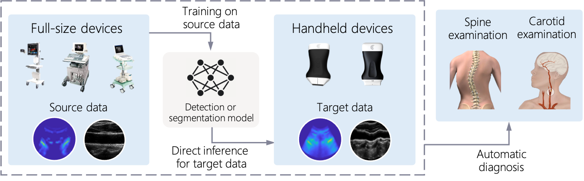
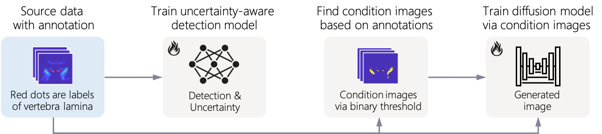
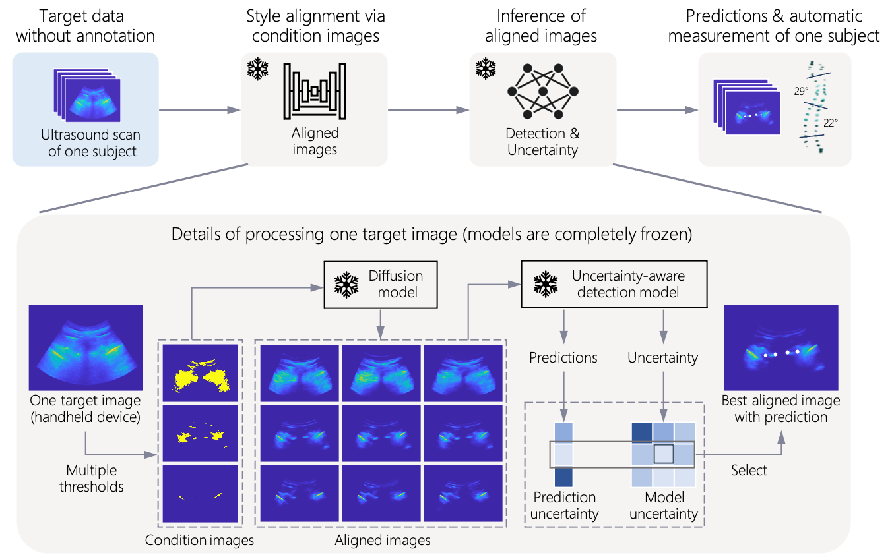

# Training-free image style alignment (TISA)
## Our paper has been accepted by IEEE Trans on Medical Imaging: ["Training-free image style alignment for domain shift on handheld ultrasound devices"](https://ieeexplore.ieee.org/abstract/document/10813622)
## Introduction

Handheld ultrasound devices face usage limitations due to user inexperience and cannot benefit from supervised deep learning without extensive expert annotations. Moreover, the models trained on standard ultrasound device data are constrained by training data distribution and perform poorly when directly applied to handheld device data. In this study, we propose the Training-free Image Style Alignment (TISA) framework to align the style of handheld device data to those of standard devices. The proposed TISA can directly infer handheld device images without extra training and is suited for clinical applications. We show that TISA performs better and more stably in medical detection and segmentation tasks for handheld device data. We further validate TISA as the clinical model for automatic measurements of spinal curvature and carotid intima-media thickness. The automatic measurements agree well with manual measurements made by human experts and the measurement errors remain within clinically acceptable ranges. We demonstrate the potential for TISA to facilitate automatic diagnosis on handheld ultrasound devices and expedite their eventual widespread use.

## Data preparation
We collected source and target data through ultrasound spinal and carotid examinations, using standard and handheld ultrasound devices:
* Spine source data: Sonix
* Spine target data: Clarius C3
* Carotid source data: Philips HDI 5000, Esaote MyLab25
* Carotid target data: Clarius L7

We provide some examples of spine data and carotid target data [here](https://drive.google.com/drive/folders/10EdWs95OzQk8GaJHTCm3PyeEgGt28cyh). Carotid source data could be acquired from [carotid ultrasound boundary study (CUBS)](https://data.mendeley.com/datasets/fpv535fss7/1)

Download above data and organize the dataset directory structure as follows:
```
data/
    spine/
        source/
            train/
            train_label/
        target
            test/
            test_label/
```
## Workflow of TISA

### Step 1: Train models on source data


For spine ultrasound data:
```
python ddpm/ddpm_train.py --data_type spine --save_dir checkpoints/carotid_ddpm
python controlnet/controlnet_train.py --ddpm_ckpt checkpoints/carotid_ddpm
python detection/det_train.py --save_dir checkpoints/spine_det --seed RANDOM_SEED --deive YOUR_DEVICE_ID
```
For carotid ultrasound data:
```
python ddpm/ddpm_train.py --data_type carotid --save_dir checkpoints/carotid_ddpm
python segmentation/det_train.py --save_dir checkpoints/carotid_unet --seed RANDOM_SEED --deive YOUR_DEVICE_ID
```

### Step 2: Training-free alignment for target data

You can download trained models from [here](https://drive.google.com/drive/folders/10EdWs95OzQk8GaJHTCm3PyeEgGt28cyh).

For spine ultrasound data:
```
python detection/TISA.py --det_ckpt YOUR_PATH --controlnet_ckpt YOUR_PATH
```
For carotid ultrasound data:
```
python segmentation/TISA.py --data_dir YOUR_PATH --unet_ckpt YOUR_PATH --ddpm_ckpt YOUR_PATH
```

### Automatic measurement
